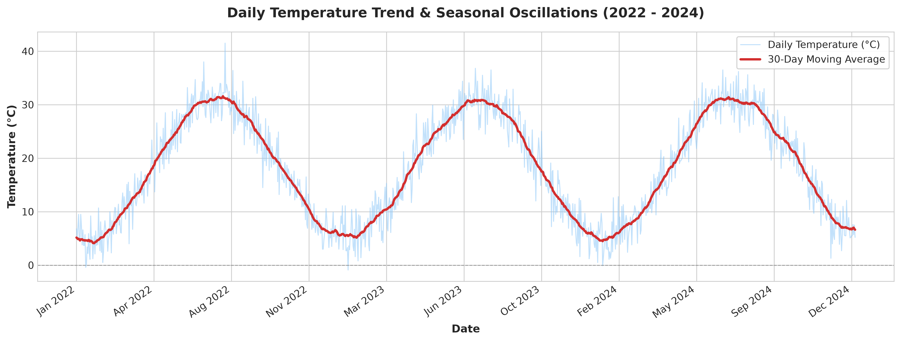
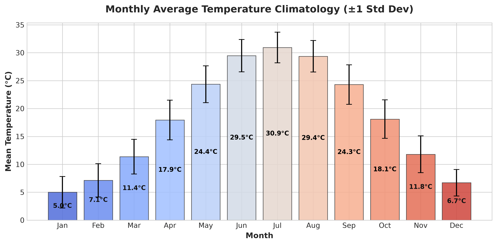
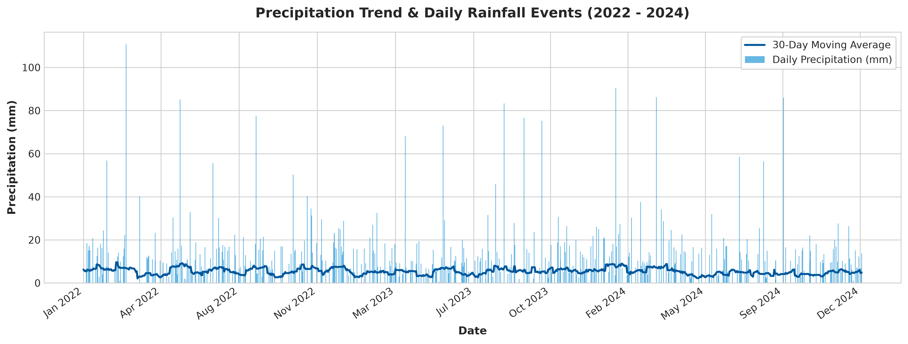
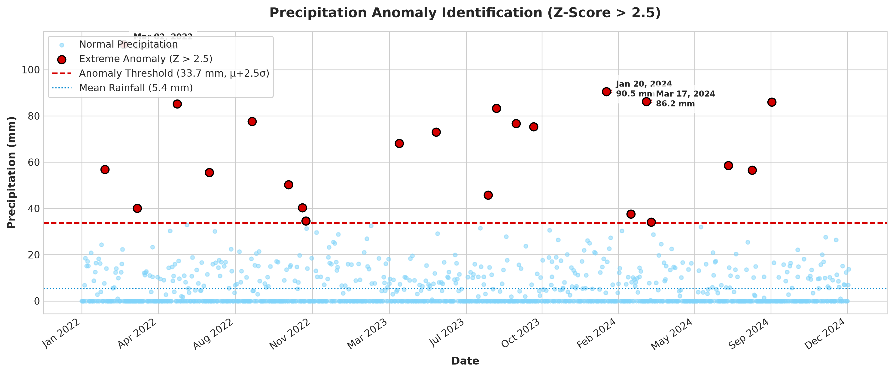
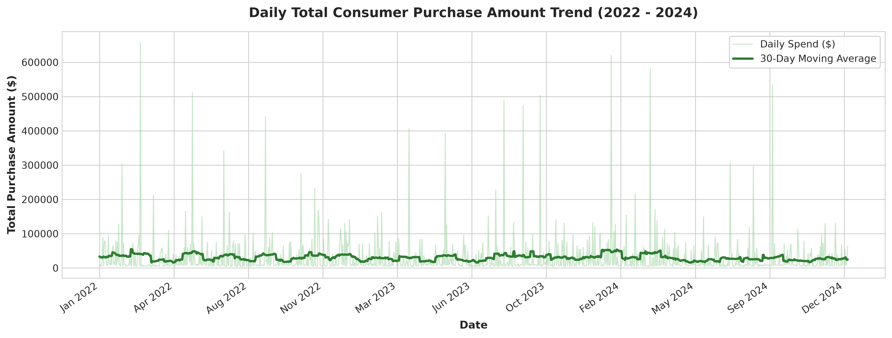
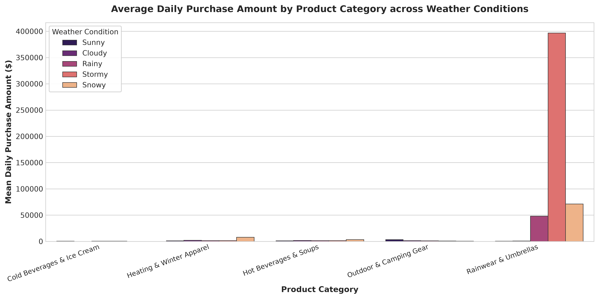
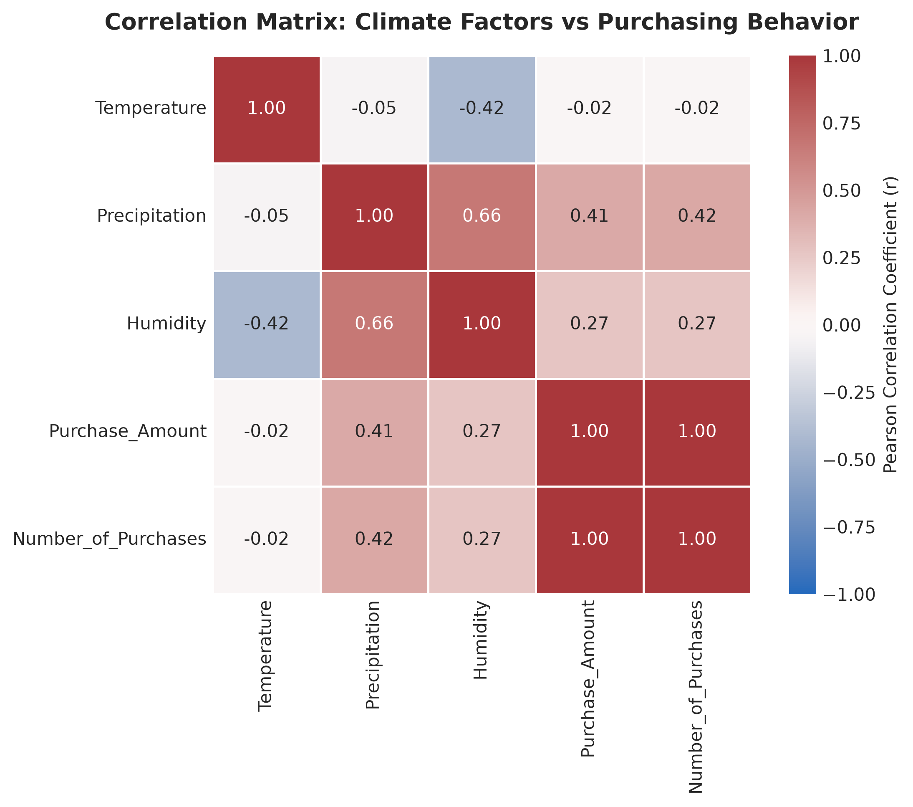
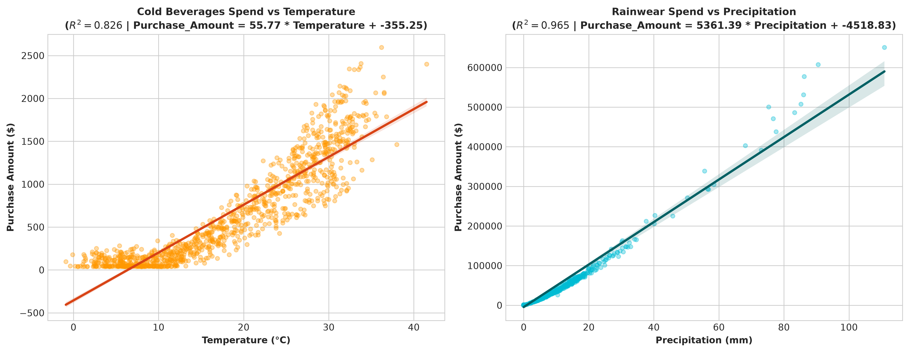

# Climate Weather Pattern Analysis

Data analysis and visualization project using Python.

## Project Overview

End-to-end climate and weather pattern analysis with data preprocessing, statistical analysis, hypothesis testing, machine learning, and visualization.

## Key Results

- 5,480 cleaned records
- 8 visualizations generated
- 36.5% rainy days
- 22 precipitation anomaly events
- Multivariable regression R²: 0.9586

## Visualizations

### 1. Temperature Trend

### 2. Monthly Average Temperature

### 3. Precipitation Trend

### 4. Precipitation Anomalies

### 5. Purchase Amount Trend

### 6. Product Category Comparison

### 7. Correlation Heatmap

### 8. Regression Analysis

